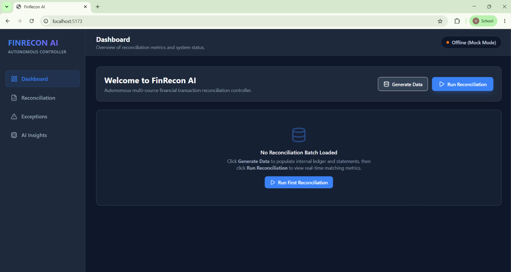
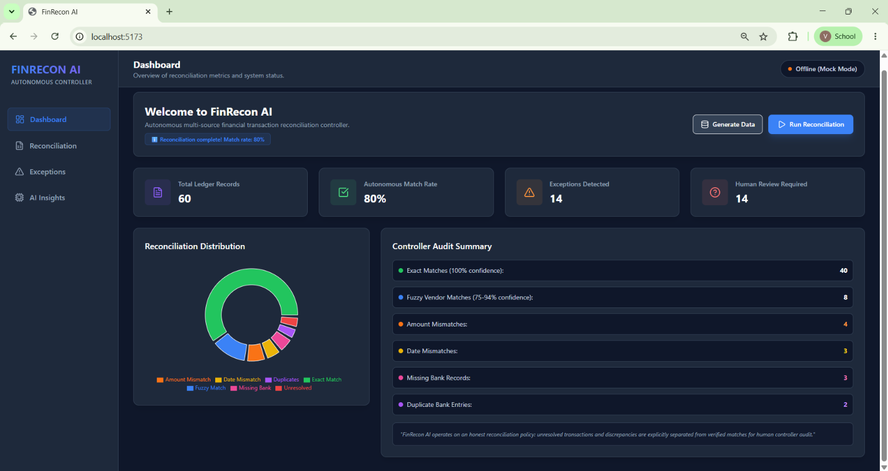
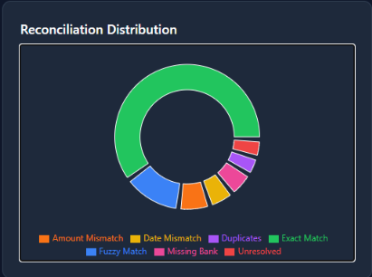
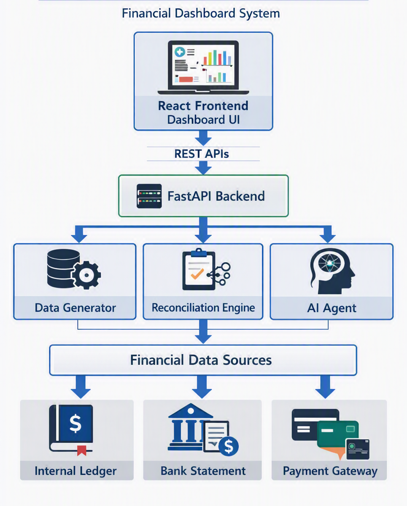
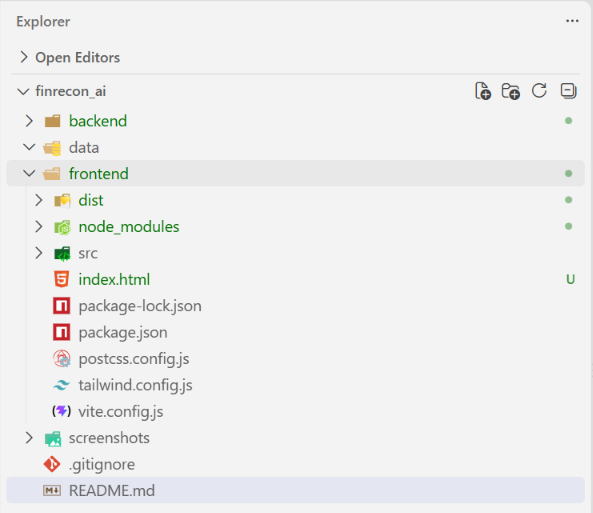
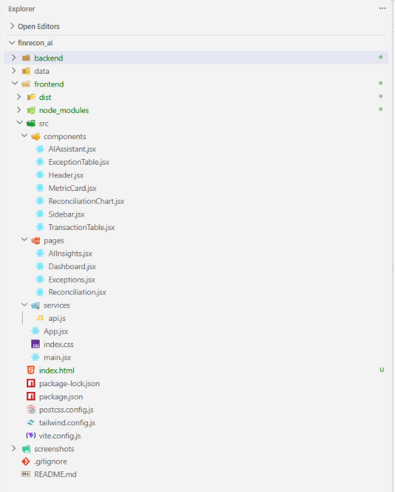
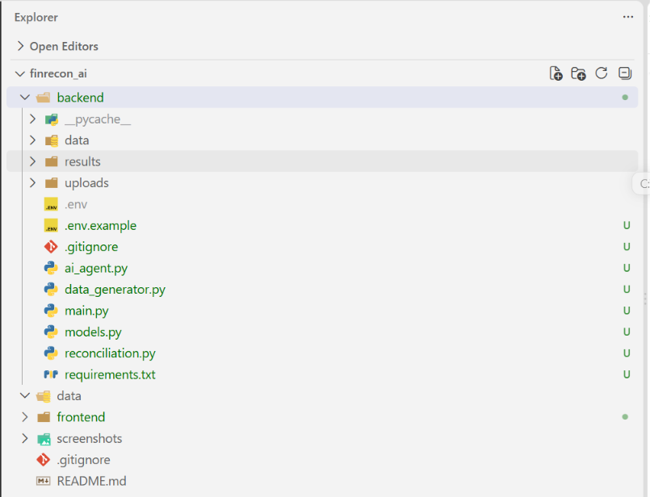
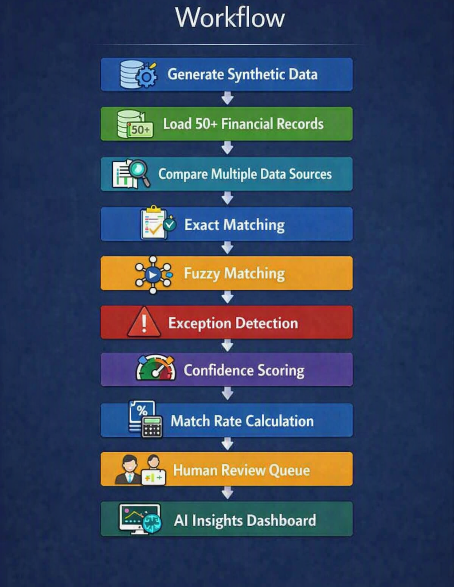
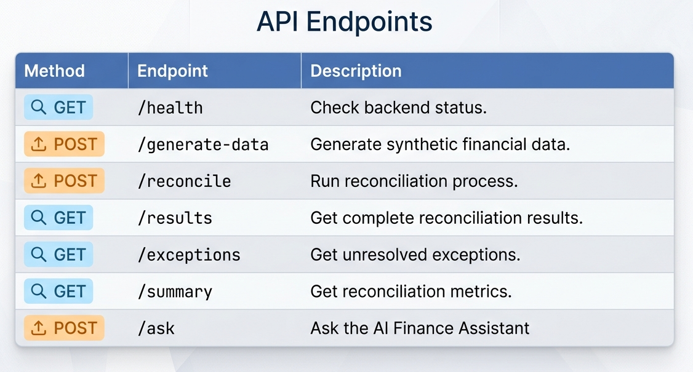

# FinRecon AI – Autonomous AI Finance Controller

##  Overview

FinRecon AI is an AI-powered financial reconciliation platform designed to automate the comparison and validation of financial transactions across multiple data sources.

Finance teams often spend significant time manually comparing records from internal accounting systems, bank statements, and payment gateway settlements. These records frequently contain inconsistencies such as vendor name variations, settlement fee differences, date mismatches, missing transactions, and duplicate records.

FinRecon AI acts as an autonomous finance operations assistant that intelligently reconciles transactions, detects discrepancies, assigns confidence scores, explains decisions, prioritizes financial risks, and escalates uncertain cases for human review.

Unlike traditional reconciliation tools that attempt to force every transaction into a match, FinRecon AI follows an honest AI approach:

- High-confidence transactions are automatically resolved.
- Medium-confidence transactions are intelligently suggested.
- Low-confidence transactions are escalated for human review.

The system is designed to demonstrate how AI can improve finance operations while maintaining transparency, explainability, and human oversight.

#  Problem Statement

Finance operations teams manage transaction records across multiple systems, including:

- Internal accounting ledgers
- Bank statements
- Payment gateway settlement reports

The same transaction may appear differently across these systems.

Common reconciliation problems include:

- Vendor names appearing in different formats
- Settlement amounts differing because of processing fees
- Transaction dates not matching exactly
- Missing bank transactions
- Duplicate records
- Ambiguous transactions requiring manual verification

As transaction volume increases, manual reconciliation becomes slow, repetitive, error-prone, and difficult to audit.

Existing automation tools often focus only on matching records. However, finance teams also need visibility into:

- What was successfully resolved
- Why a transaction was matched
- What exceptions remain
- Which issues require immediate attention
- Which transactions require human verification

---

# 💡 Solution

FinRecon AI is an Autonomous AI Finance Controller that processes financial transaction batches from multiple sources and performs intelligent reconciliation.

The system:

1. Generates synthetic financial transactions.
2. Processes records from multiple financial systems.
3. Performs exact transaction matching.
4. Uses fuzzy matching for vendor variations.
5. Detects amount discrepancies.
6. Detects date discrepancies.
7. Identifies missing transactions.
8. Detects duplicate records.
9. Assigns confidence scores.
10. Calculates reconciliation match rates.
11. Generates explainable AI decisions.
12. Prioritizes financial exceptions.
13. Escalates uncertain transactions for human review.

---

# ✨ Key Innovation

## AI That Knows When Not to Automate

One of the core principles of FinRecon AI is that AI should not blindly automate financial decisions.

Instead, the system uses confidence-based decision making.

High Confidence
      ↓
Automatic Resolution

Medium Confidence
      ↓
AI Recommendation

Low Confidence
      ↓
Human Review Required

# ✨ Features

## 🖥️ Interactive Dashboard

The FinRecon AI dashboard provides a complete overview of the financial reconciliation process in one place.

Key features include:

- Total transaction records overview
- Exact match count
- Fuzzy match count
- Overall reconciliation match rate
- Amount mismatch statistics
- Date mismatch statistics
- Missing transaction detection
- Duplicate transaction detection
- Unresolved exception count
- Financial reconciliation health overview
- Real-time summary of reconciliation results

The dashboard helps finance teams quickly understand the overall status of financial operations.
The FinRecon AI dashboard provides a complete overview of the reconciliation process, including transaction statistics, match rates, exceptions, and reconciliation analytics.

---

## 📊 Reconciliation Analytics

FinRecon AI provides visual analytics to make reconciliation results easier to understand.

Features include:

- Reconciliation performance charts
- Match vs exception comparison
- Exact and fuzzy match visualization
- Exception distribution analysis
- Financial reconciliation metrics
- Data-driven insights for finance teams

Charts are built using Recharts for clear and interactive visualization.

---

## 🔄 Intelligent Transaction Reconciliation

The system automatically compares transactions across multiple financial sources.

Supported sources:

- Internal Ledger
- Bank Statement
- Payment Gateway Settlement Records

The reconciliation engine performs:

- Exact transaction matching
- Fuzzy vendor matching
- Amount validation
- Date validation
- Missing record detection
- Duplicate transaction detection
- Unresolved transaction identification

---

## 🎯 Confidence-Based Matching

Every transaction reconciliation result receives a confidence score.

Confidence levels help determine whether a transaction should be automatically resolved or reviewed manually.

High Confidence
→ Automatically Resolved

Medium Confidence
→ AI Suggested Match

Low Confidence
→ Requires Human Review
### Multi-Source Reconciliation

Reconciles transactions across:

- Internal Ledger
- Bank Statement
- Payment Gateway Settlement Records

### Intelligent Matching

Supports:

- Exact Matching
- Fuzzy Vendor Matching
- Amount Comparison
- Date Comparison

### Exception Detection

Detects:

- Amount Mismatches
- Date Mismatches
- Missing Bank Records
- Duplicate Transactions
- Unresolved Transactions

### AI Finance Assistant

Users can ask questions such as:

- Why is the match rate low?
- How many transactions require human review?
- What are the main causes of reconciliation exceptions?
# Architecture

# Technology Stack
### Frontend: 
    React
    Vite
    Axios
    Recharts
    Lucide React
### Backend:
    Python
    FastAPI
    Uvicorn
    PandasS
    RapidFuzz
    Pydantic
### AI
    OpenAI API 
    Rule-based fallback insights

# 📁 Project Structure

#  How It Works
Generate Synthetic Data
        ↓
Load 50+ Financial Records
        ↓
Compare Multiple Data Sources
        ↓
Exact Matching
        ↓
Fuzzy Matching
        ↓
Exception Detection
        ↓
Confidence Scoring
        ↓
Match Rate Calculation
        ↓
Human Review Queue
        ↓
AI Insights Dashboard

# Matching Logic
Exact Match

Transactions are matched based on:

Same amount
Same or nearby date
Matching transaction/vendor information
Fuzzy Match

RapidFuzz is used to identify similar vendor names.

Example:

Amazon India
        ↓
AMAZON PAY INDIA
Amount Mismatch

Detected when vendor information matches but transaction amounts differ.

Date Mismatch

Detected when transaction amounts and vendors match but dates differ beyond the allowed tolerance.

Missing Record

Detected when a transaction exists in one source but cannot be found in another.

Duplicate Detection

Flags duplicate transactions to prevent the same record from being incorrectly matched multiple times.

# API Endpoints
| Method | Endpoint         | Description                         |
| ------ | ---------------- | ----------------------------------- |
| GET    | `/health`        | Check backend status                |
| POST   | `/generate-data` | Generate synthetic financial data   |
| POST   | `/reconcile`     | Run reconciliation process          |
| GET    | `/results`       | Get complete reconciliation results |
| GET    | `/exceptions`    | Get unresolved exceptions           |
| GET    | `/summary`       | Get reconciliation metrics          |
| POST   | `/ask`           | Ask the AI Finance Assistant        |

# Installation
## 1. Clone the Repository
git clone https://github.com/YOUR_USERNAME/finrecon-ai.git
cd finrecon-ai
## 2. Backend Setup
cd backend

Create a virtual environment:

python -m venv venv

Activate it on Windows:

venv\Scripts\activate

Install dependencies:

pip install -r requirements.txt

Run the backend:

uvicorn main:app --reload

Backend will run at:

http://127.0.0.1:8000

API documentation:

http://127.0.0.1:8000/docs

## 3. Frontend Setup

Open a new terminal.

cd frontend
npm install
npm run dev

Frontend will run at:

http://localhost:5173
Usage
Step 1: Start Backend
cd backend
uvicorn main:app --reload
Step 2: Start Frontend
cd frontend
npm run dev
Step 3: Generate Data

Click the Generate Data button or call:

POST /generate-data
## Step 4: Run Reconciliation

Click:

Run Reconciliation
Example Metrics
Total Records Processed: 60

Exact Matches: 40
Fuzzy Matches: 8

Amount Mismatches: 4
Date Mismatches: 3
Missing Records: 3
Duplicate Records: 2

Match Rate: 80%

The system will process the complete batch and generate:

Match rate
Successfully matched records
Exceptions
Confidence scores
Human review requirements

# Why FinRecon AI?

The goal is not to claim perfect automation.

FinRecon AI focuses on:

Throughput + Measured Accuracy + Honest Exception Reporting

Processing an entire batch and clearly identifying what cannot be resolved is more valuable than demonstrating a single perfect transaction match.

## Future Improvements
Support Excel and PDF financial statements
Real-time bank API integration
Database storage
Role-based authentication
Advanced anomaly detection
Automated accounting journal entries
Multi-currency reconciliation
Predictive cash flow forecasting
## Contributors
Vasari Rishika

# License

This project was developed as a hackathon project for educational and demonstration purposes.

---
# FinRecon AI
| [Demo Video](https://drive.google.com/file/d/1LBGJ7t-lMJQeuRQqIJKYclcX5Fi6_36j/view?usp=drive_link)

> Autonomous AI Finance Controller for multi-source reconciliation.